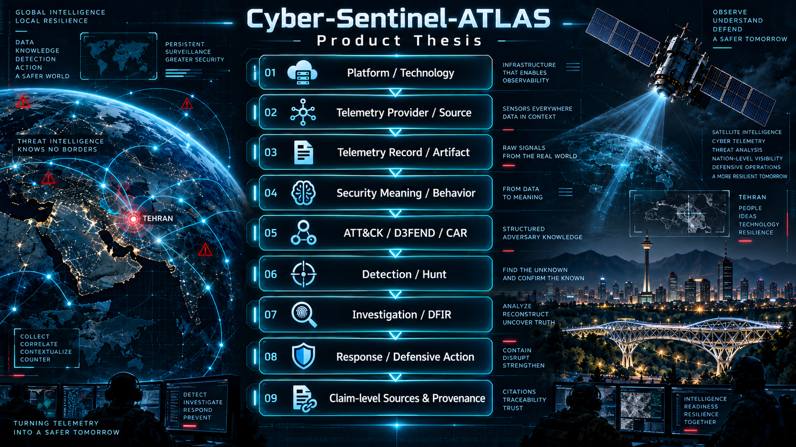
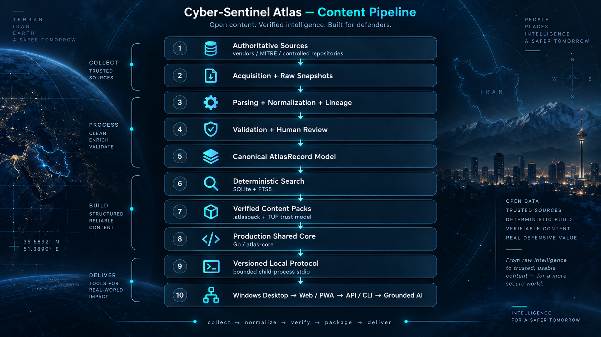
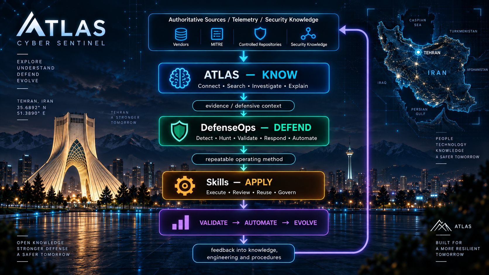

# Cyber-Sentinel-Atlas

**Provenance-First Cyber Defense Knowledge & Investigation Platform**

[](docs/current-status.md)
[](docs/releases/phase-5.10.5-usable-data-preview.md)
[](docs/releases/phase-5.10-public-preview-readiness.md)


Cyber-Sentinel-Atlas is the **KNOW** layer of the Cyber-Sentinel ecosystem: an offline-first cyber-defense knowledge and investigation platform that connects telemetry, canonical security records, adversary behavior, detections, hunts, DFIR artifacts, relationships, and claim-level provenance into one inspectable analyst workflow.

ATLAS is built for security teams that need investigation context to be **deterministic, attributable, reviewable, offline-capable, and operationally safe** rather than dependent on scattered references, opaque retrieval, or ungrounded AI output.

> **First Preview engineering readiness:** READY
> **Usable Data Preview:** COMPLETE / MERGED / POST-MERGE VERIFIED
> **Current maturity:** Engineering-ready First Preview
> **Release state:** Pre-preview / unreleased
> **Repository visibility:** Public
> **Active workstream:** Phase 5.10.7 — Public Preview RC functional freeze & evidence closure
> **RC target:** `v0.1.0-rc.1` — functionally frozen; release evidence still blocked
> **Public Preview state:** **BLOCKED** until every mandatory release gate passes
> **Desktop:** Windows / Tauri 2.x — ADR-0026 Accepted
> **Shared Core:** Go / bounded child-process stdio
> **Licensing note:** No project `LICENSE` is currently published; public visibility does not grant reuse or redistribution rights

Foundation regression invariants: **Phase 5.1 — Product Foundation: COMPLETE**; **Stage 1 — Governance / Architecture Sync: COMPLETE**.

Public repository visibility does not imply a signed public release, GA status, or universal production approval. The engineering-ready First Preview, the Phase 5.10.5 Usable Data Preview evidence, and a publicly distributable security product are intentionally separate release states.

## Product Thesis

Security investigation knowledge is fragmented across operating systems, SIEMs, EDR/XDR platforms, cloud environments, container runtimes, vendor documentation, detection repositories, threat intelligence, DFIR references, standards, and analyst experience.

ATLAS connects these sources without collapsing their trust boundaries. Material technical claims remain bound to inspectable evidence, deterministic retrieval precedes optional semantic augmentation, and verified offline content remains usable when network access is restricted or unavailable.

**No technical claim without provenance.**

<p align="center">
  
</p>

ATLAS is designed as a **Cyber Defense Knowledge Graph + Analyst Workbench + Verified Offline Knowledge Platform**.

Its core question is:

> **What do we know about what we are seeing — and what evidence supports it?**

## Why ATLAS Exists

A SOC analyst should not have to search ten unrelated sources to understand one event, technique, artifact, relationship, defensive control, or investigation pivot. ATLAS creates a governed knowledge layer that can answer those questions while preserving source identity, version context, confidence boundaries, and traceability.

ATLAS is not an Event ID wiki, an ATT&CK browser, a SIEM-specific portal, a detection-rule dump, or an ungrounded AI chatbot. It is the knowledge and investigation layer around which those sources can be connected safely.

## Designed For

- SOC analysts and incident responders;
- threat hunters and DFIR practitioners;
- detection and security engineers;
- blue and purple teams;
- security architects and platform teams;
- regulated, disconnected, restricted, sovereign, and high-assurance environments;
- enterprises building AI-assisted security workflows that require deterministic grounding and inspectable provenance.

## Enterprise Value

ATLAS is designed to reduce investigation friction while preserving evidence and trust boundaries. The product direction emphasizes:

- **Faster investigation:** exact identifier resolution, lexical retrieval, graph pivots, and provenance in one analyst surface;
- **Operational resilience:** verified offline knowledge packs and no mandatory cloud dependency for core investigation;
- **Trustworthy knowledge:** source lineage, claim-level provenance, lifecycle/version context, and deterministic canonical contracts;
- **Controlled updates:** TUF-based pack trust, anti-rollback controls, immutable generations, health-gated activation, and Last Known Good recovery;
- **Reduced platform coupling:** vendor-neutral canonical knowledge with explicit vendor/source context rather than a SIEM-owned knowledge model;
- **AI-ready grounding:** deterministic retrieval and evidence remain authoritative; future AI assistance cannot silently become canonical truth;
- **Enterprise release discipline:** reproducible builds, SBOM evidence, vulnerability gates, explicit release authority, rollback, revocation, accessibility, signing, and redistribution controls.

## Current Product Capabilities

The engineering-ready Windows First Preview provides:

- offline global search;
- canonical record and entity detail;
- deterministic exact-before-lexical resolution;
- bounded relationship and graph navigation;
- claim and source provenance;
- Windows Event / Sysmon investigation context available in the active pack;
- verified pack status and controlled update;
- safe rollback / recovery visibility;
- diagnostics;
- UTC, system-local, and Tehran/Jalali presentation;
- operational dark UI with high-contrast/accessibility controls.

Phase 5.10.5 additionally proves on clean Windows, from one packaged artifact, an end-to-end analyst flow for Windows Security Event ID `4688` and Sysmon Event ID `1` through Search → Record → Graph → Provenance, with deliberate TUF target tampering rejected fail-closed.

The selected desktop host exposes exactly seven application commands: `core_status`, `search_records`, `get_record`, `expand_graph`, `pack_status`, `pack_update`, and `pack_rollback`.

## Architecture

<p align="center">
  
</p>

ATLAS is **offline-first**. Deterministic exact and lexical retrieval works without AI, and no UI, search index, upstream source, or model response becomes canonical truth merely because it was returned to an analyst.

### Accepted production boundary

| Area | Accepted boundary |
| --- | --- |
| Canonical schema | Contract `1.0.0`, JSON Schema Draft 2020-12 |
| Canonical model | Exactly seven `AtlasRecord` families |
| Search | SQLite + FTS5, exact-before-lexical deterministic retrieval |
| Content trust | TUF-based verification, trusted-time, highest-seen rollback protection |
| Pack runtime | Verified `.atlaspack`, immutable generations, health-gated activation, Last Known Good |
| Shared Core | Go — ADR-0024 |
| Conformance oracle | Python |
| Desktop host | Tauri 2.x — ADR-0026 |
| Desktop/Core IPC | `atlas-core --serve-stdio`, protocol `atlas-core/1.0.0` |
| Framing | Bounded 4-byte unsigned big-endian length prefix + UTF-8 JSON |
| Network posture | No default local HTTP/TCP/WebSocket listener; no hidden network fallback |
| User-facing CLI | `atlas` |

The Desktop layer consumes Shared Core capabilities but does not duplicate or redefine canonical validation, deterministic search/graph semantics, TUF verification, durable trust state, or rollback protection.

### Canonical model

The v1 contract contains exactly seven record families:

- `EntityRecord`
- `ClaimRecord`
- `RelationshipRecord`
- `SourceRecord`
- `ValidationRecord`
- `VersionRecord`
- `CoverageSnapshot`

Canonical schema URI base:

```text
https://raw.githubusercontent.com/cyber-sentinel/Cyber-Sentinel-Atlas/main/schemas/v1/
```

Schema changes are explicit, versioned, and guarded against silent drift.

## Content & Trust Pipeline

```text
Authoritative Source
        ↓
Acquisition + Raw Snapshot
        ↓
Parser + Normalizer + Lineage
        ↓
Canonical Candidate Corpus
        ↓
Inventory Diff + Validation + Human Review
        ↓
PACK_READY
        ↓
Signed / Verified .atlaspack
        ↓
Immutable Generation + Health Gate
        ↓
ACTIVE / Last Known Good
```

`PACK_READY` is a governed promotion state; it is not equivalent to signed, installed, active, or publicly released content.

## First Preview Security Posture

The First Preview intentionally keeps a narrow local attack surface:

- one main-window capability boundary;
- exactly seven exposed application commands;
- no generic frontend-controlled Shared Core method bridge;
- no Tauri plugin surface;
- CSP `connect-src 'none'`;
- no default application network listener;
- adjacent SHA-256-bound `atlas-core.exe` sidecar;
- fail-closed sidecar corruption handling and verified recovery;
- verified pack trust, trusted-time, anti-rollback, and LKG semantics inherited from the frozen Shared Core;
- no application binary auto-update path in First Preview.

These controls are engineering evidence, not a claim that every enterprise environment can deploy ATLAS without its own risk assessment and change control.

## Verified Engineering Milestones

| Boundary | State |
| --- | --- |
| Phase 5.1 — Product Foundation | **COMPLETE** |
| Phase 5.2 — Canonical Data Model | **COMPLETE / MERGED** |
| Phase 5.3 — Source & Ingestion Core | **COMPLETE / MERGED** |
| Phase 5.4 — Deterministic Search Core | **COMPLETE / MERGED** |
| Phase 5.5 — Offline Pack Runtime / Shared Core | **COMPLETE / MERGED / POST-MERGE VERIFIED / FROZEN** |
| Phase 5.6 — Windows Desktop MVP | **COMPLETE / MERGED / POST-MERGE VERIFIED** |
| G-D1 through G-D9 | **PASS / VERIFIED** |
| ADR-0026 desktop selection | **ACCEPTED — Tauri 2.x** |
| First Preview engineering readiness | **READY** |
| Phase 5.10 — Public Preview Readiness | **ACTIVE** |
| Phase 5.10.5 — Usable Data Preview | **COMPLETE / MERGED / POST-MERGE VERIFIED** |

Post-merge verification run `35305516189` succeeded on engineering baseline `main@4d64b2fb402b280d00c01783f7990538a3b67484`. Both `build exact-head usable data preview` and `clean Windows first-run Search Record Graph` passed. The post-merge package artifact is `phase5105-usable-data-preview` (artifact `10530884223`, digest `sha256:174009a03ca99c5df83f3ab4489319f88ab9ff02a1c94343cecd066ac8b9f435`) and the clean-Windows evidence is `phase5105-clean-windows-evidence` (artifact `10532105635`, digest `sha256:efea2fd75a83f6300d7463217a7412c96324a5428e8eaf2ae08ac548039ee438`).

Phase 5.6 release authority is backed by the merged implementation and post-merge Windows packaging/smoke evidence. The First Preview artifact remains an **unsigned portable ZIP**; production signing and public distribution are separate Phase 5.10 controls.

## Public Preview Readiness

Public Preview is intentionally fail-closed. The current mandatory gate state is:

| Gate | Readiness area | State |
| --- | --- | --- |
| PPR-01 | First Preview engineering baseline | **PASS** |
| PPR-02 | Security disclosure and supported-release policy | **PASS** |
| PPR-03 | First-party licensing decision | **BLOCKED** |
| PPR-04 | Third-party redistribution closure | **BLOCKED** |
| PPR-05 | Production code signing and key custody | **BLOCKED** |
| PPR-06 | Public packaging and distribution hardening | **BLOCKED** |
| PPR-07 | Accessibility release review | **PARTIAL** |
| PPR-08 | Source freshness and public-pack publication policy | **PASS** |
| PPR-09 | Release governance and launch criteria | **PASS** |
| PPR-10 | Supply-chain evidence | **PASS** |
| PPR-11 | Trademark and attribution controls | **PASS** |

PPR-04 now includes an exact Windows-target Rust/Tauri redistribution preflight. PR #54 exact-head workflow run `35309913398` passed the PPR-04 redistribution control and generated Windows-target Rust/Tauri preflight evidence for 258 reachable third-party crates and 3 packaged frontend assets. Artifact `10533096533` has digest `sha256:ead00ebd410b7a5e715f1488847c7c066ec31dbed7196c1796c221f3dc75535d`. This is preflight evidence only; final corpus/software freeze, final notices, and exact release-package binding remain required.

Authoritative controls:

- [Public Preview Readiness Gate Matrix](docs/releases/phase-5.10-public-preview-readiness.md)
- [First-Party License Decision Control](docs/releases/first-party-license-decision.md)
- [Third-Party Redistribution Closure](docs/releases/third-party-redistribution-closure.md)
- [Production Signing & Key Custody](docs/releases/production-signing-and-key-custody.md)
- [Public Packaging & Distribution](docs/releases/public-packaging-and-distribution.md)
- [Machine-Readable Gate State](docs/releases/phase-5.10-public-preview-readiness.json)
- [Phase 5.10.5 Usable Data Preview Evidence](docs/releases/phase-5.10.5-usable-data-preview.md)
- [Source Freshness & Public Pack Publication Policy](docs/releases/source-freshness-and-publication-policy.md)
- [Public Preview Launch Governance](docs/releases/public-preview-launch-governance.md)
- [Accessibility Release Review Contract](docs/releases/accessibility-release-review.md)
- [Public Preview RC Functional Freeze Contract](docs/releases/public-preview-rc-contract.md)

PPR-08 and PPR-09 are policy-closed and CI-enforced. PPR-07 remains partial until the exact packaged Public Preview candidate completes the executable Windows keyboard/Narrator/high-contrast/DPI review. Licensing, redistribution, production signing, and public packaging remain explicit blockers and are not auto-selected by tooling.

Phase 5.10.5 improves the engineering usability baseline but **does not** convert any PPR blocker into PASS and does not authorize a Public Preview release.

## Deployment & Integration Model

The First Preview is Windows-first and portable. Core investigation remains local and offline-capable. Future enterprise deployment can build around the same bounded contracts rather than embedding product-specific logic into the UI.

Integration boundaries are deliberately explicit:

- ATLAS consumes authoritative/reference content through governed ingestion and provenance;
- DefenseOps may provide validated defensive engineering content through a controlled import boundary;
- Skills may reference ATLAS knowledge and DefenseOps engineering artifacts without inheriting ownership or trust;
- future API/CLI and AI surfaces must reuse the canonical and Shared Core contracts rather than create parallel truth stores.

## Cyber-Sentinel Ecosystem

ATLAS is the **KNOW** layer of a three-part cyber-defense operating model:

<p align="center">
  
</p>

```text
Cyber-Sentinel
├── ATLAS       — KNOW   → Connect • Search • Investigate • Explain
├── DefenseOps  — DEFEND → Detect • Hunt • Validate • Respond • Automate
└── Skills      — APPLY  → Execute • Review • Reuse • Govern
```

Controlled content may move between products only through explicit provenance, validation, versioning, authorization, and release boundaries.

## Product Boundaries

ATLAS owns governed knowledge, retrieval, provenance, relationships, trust, and analyst investigation context.

It does **not** replace:

- SIEM/EDR/XDR telemetry collection;
- DefenseOps detection/hunting engineering;
- Skills operating procedures;
- organizational incident command or change control;
- environment-specific production validation;
- legal/licensing review for public redistribution.

## Engineering & Release Discipline

Every material product claim should have inspectable evidence. Repository CI is treated as a control, not marketing.

ATLAS distinguishes:

- **engineering ready** — defined engineering and verification gates passed;
- **usable data preview verified** — a packaged clean-Windows analyst workflow proves real knowledge retrieval plus fail-closed tamper behavior;
- **Public Preview ready** — all mandatory PPR gates passed with concrete release evidence;
- **production ready** — environment-specific and not inferable from repository CI alone.

The authoritative workflow is:

```text
Branch → PR → CI → architecture/security review → exact-head verification
      → merge → post-merge verification → controlled release authority
```

Mandatory release gates are not weakened to obtain a green build.

## Near-Term Roadmap

The critical path is Phase 5.10 Public Preview readiness:

```text
First Preview engineering closure                         COMPLETE
        ↓
Phase 5.10.5 usable-data analyst flow                    POST-MERGE VERIFIED
        ↓
Phase 5.10.6 release vehicle/accessibility hardening      MERGED / VERIFIED
        ↓
Phase 5.10.7 functional freeze for v0.1.0-rc.1            ACTIVE / RC EVIDENCE BLOCKED
        ↓
PPR-08 freshness/publication policy                      PASS
PPR-09 launch/rollback/revocation governance             PASS
PPR-07 packaged accessibility review                     PARTIAL
        ↓
First-party license + third-party redistribution         BLOCKED
        ↓
Production signing + protected key custody               BLOCKED
        ↓
Signed public packaging / distribution hardening         BLOCKED
        ↓
Strict Public Preview release gate                       BLOCKED
```

Web/PWA, broader API surfaces, and Grounded AI remain deferred beyond the First Preview critical path. Future AI remains subordinate to deterministic retrieval, provenance, and canonical truth.

## Governance, Security & Licensing

- [Current Authoritative Status](docs/current-status.md)
- [Project State](docs/project-state.md)
- [Roadmap](docs/roadmap.md)
- [Phase 5.10.5 Usable Data Preview Evidence](docs/releases/phase-5.10.5-usable-data-preview.md)
- [Security Policy](SECURITY.md)
- [Contribution Guidance](CONTRIBUTING.md)
- [Third-Party Notices](THIRD_PARTY_NOTICES.md)
- [Trademark Guidance](TRADEMARKS.md)
- [Citation Metadata](CITATION.cff)

The repository is public for inspectability and collaboration. Until a first-party `LICENSE` is explicitly published and applicable third-party rights are closed, reuse, redistribution, repackaging, and commercial incorporation should be assessed conservatively.

---

**Maintainer:** Ali RahimDabagh

**Profile:** `cyber-sentinel`

**Ecosystem role:** `KNOW`

**Focus:** Cyber Defense Knowledge • SOC Investigation • DFIR • Threat Hunting • Provenance • Offline Security Platforms • Security Architecture
